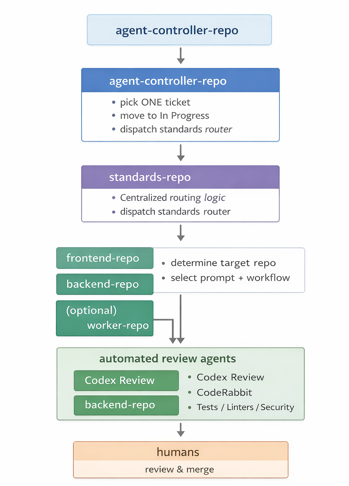

# A “Junior Engineer” AI Agent for Deterministic Engineering Workflows

This repository documents a **practical pattern** for using AI as a constrained execution agent in software engineering workflows.

The core idea is intentionally simple:

> AI is most useful when it executes **process**, not when it makes **judgment**.

Instead of asking AI to behave like a senior or principal engineer, this pattern treats AI like a careful **junior engineer** — one that follows rules literally, executes deterministic workflows, and hands all meaningful decisions back to humans.

This is a reference pattern, not a product.

---

## Why this pattern exists

Most AI developer tools aim high: architecture suggestions, large refactors, and design decisions that normally require deep domain context.

In practice, most engineering time is not spent on architecture. It’s spent on **workflow execution**:
- selecting eligible work
- enforcing process rules
- moving tickets through states
- coordinating across repositories
- triggering automation
- debugging CI when it behaves unpredictably

These tasks are:
- necessary
- repetitive
- error-prone
- a poor use of senior attention

They require **precision**, not creativity — which makes them a good fit for a constrained execution agent.

---

## What “junior engineer” means here

The term “junior engineer” is intentional.

This agent:
- follows instructions literally
- applies rules exactly as written
- operates on one unit of work at a time
- makes small, scoped changes
- surfaces ambiguity instead of working around it

### The agent is NOT allowed to:
- make architecture decisions
- make product or business judgments
- perform large refactors
- merge code
- silently change behavior

### The agent IS allowed to:
- execute deterministic workflows
- draft partial implementations
- leave TODOs when requirements are unclear
- fail loudly with clear explanations

These constraints are what make the system safe and predictable.

---

## High-level architecture

At a high level, the system is split into clearly bounded components:

1. **Controller**
   - Selects exactly one eligible unit of work
   - Enforces workflow rules
   - Claims the work deterministically

2. **Standards layer**
   - Routes work based on explicit rules
   - Centralizes prompts and guardrails
   - Prevents repo-specific drift

3. **Execution agents**
   - Run inside product repositories
   - Draft small, scoped pull requests
   - Do not make cross-cutting changes

4. **Automated review**
   - CI, linting, tests
   - Optional AI review tools
   - No approvals, only feedback

5. **Humans**
   - Review business logic
   - Assess risk and deployment impact
   - Decide what ships

There is no hidden state. Everything is visible through commits, pull requests, and logs.

---

## Repository boundaries (intentional)

This pattern works best when responsibilities are separated:

- **Controller repo**
  - Work selection
  - Orchestration
  - State transitions

- **Standards repo**
  - Routing logic
  - Shared prompts
  - Invariants and guardrails

- **Product repos**
  - Actual code changes
  - Narrow, context-specific execution

This separation avoids tight coupling and makes behavior auditable and evolvable.

---

## What this pattern does NOT do

This system does not:
- replace engineers
- understand domain context automatically
- fix poor requirements
- eliminate the need for human review
- autonomously ship code

Ambiguity is surfaced, not hidden. Judgment remains human.

---

## Safety properties

This pattern is designed around a few hard constraints:

- **Determinism**
  - One unit of work per run
  - Explicit routing rules
  - Predictable execution paths

- **Human authority**
  - No AI merges
  - No autonomous decisions
  - Humans control deployment

- **Auditability**
  - All actions are logged
  - All changes are visible in PRs
  - No opaque internal state

---

## Implementation notes

This pattern can be implemented using:
- GitHub Actions (or equivalent CI)
- API-based work selection
- Structured prompts with explicit constraints
- Automated review before human review

The specific tooling is less important than the **invariants**:
- one unit of work
- small changes
- explicit boundaries
- human judgment at the end

---

## When this pattern works well

- Teams with multiple repositories
- Established workflow rules
- Clear ownership boundaries
- Desire to reduce process overhead

## When it does not

- Highly ambiguous product requirements
- Rapid exploratory prototyping
- Domains where correctness cannot be reviewed by humans

---

## Further reading

A full write-up with architecture details, tradeoffs, and example workflows:
https://medium.com/@ajiferukeolatommy/a-junior-engineer-ai-agent-for-deterministic-engineering-workflows-b71fbdcb685d

---

## Status

This repository is intentionally minimal.

It serves as a **reference pattern**, not a framework or tool.  
Examples and variations may be added over time, but stability and clarity are prioritized over completeness.
